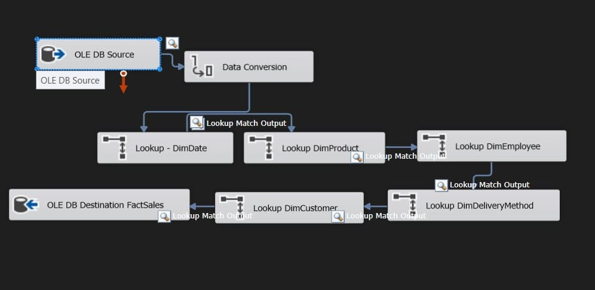
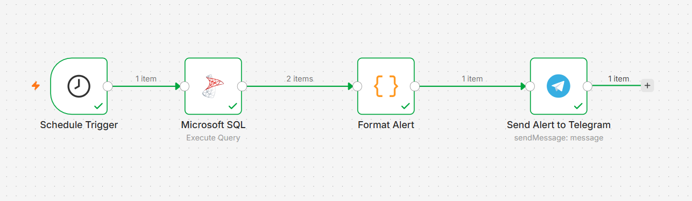

# 📦 TIJARAH — Smart Inventory & Business Intelligence Platform


## Project Overview

TIJARAH is a complete end-to-end Business Intelligence platform designed for wholesale distribution companies. It consolidates operational data from a normalized SQL Server OLTP database through a fully automated ETL pipeline into a Star Schema Data Warehouse, enabling business owners and managers to make data-driven decisions at every level — from individual product profitability to company-wide strategic planning.

The system includes a 16-table normalized OLTP database, a Star Schema Data Warehouse with 8 dimension tables and 4 fact tables, an SSIS ETL pipeline with CDC incremental loading, Power BI and Tableau dashboards, 6 T-SQL stored procedures, an AI Business Advisor powered by Google Gemini, Prophet ML sales forecasting, and a Flask web platform that ties everything together with an automated monthly executive report delivered by email.

---

## Business Problem

Wholesale distribution businesses face several compounding challenges that silently drain profitability:

- **No inventory visibility** — stock shortages and overstock discovered too late
- **Manual reporting** — hours wasted building the same reports every week in Excel
- **No supplier intelligence** — no clear view of supplier cost efficiency or order performance
- **Disconnected systems** — sales, purchasing, and inventory data trapped in separate silos
- **No AI assistance** — no way to ask business questions and get instant data-backed answers
- **Slow decision making** — insights arrive after the moment to act has already passed

TIJARAH addresses all of these with a unified, automated BI and AI platform.

---

## Architecture

```
┌─────────────────────────────────────────────────────────────────────┐
│                         TIJARAH Architecture                        │
├──────────────┬──────────────┬──────────────┬────────────────────────┤
│  OPERATIONAL │     ETL      │   STORAGE    │      INTELLIGENCE      │
│              │              │              │                        │
│  SQL Server  │  SSIS        │  SQL Server  │  Power BI · Tableau   │
│  OLTP DB     │  Pipeline    │  DWH         │  AI Advisor · Prophet │
│  16 Tables   │  CDC         │  Star Schema │  Flask Web Platform   │
└──────────────┴──────────────┴──────────────┴────────────────────────┘

From raw transaction → to business decision — in a single, governed pathway.
```

---

## Database Design (OLTP)

The OLTP database `SmartInventory` consists of **16 tables** built around the `Invoices` and `InvoiceDetails` fact tables, covering the full operational lifecycle of a wholesale distribution business.

### Entity Groups

#### Geographic (3 tables)
| Table | Key Columns |
|-------|-------------|
| `Countries` | CountryID, CountryName, Continent, Region |
| `StateProvinces` | StateProvinceID, StateProvinceName, CountryID |
| `Cities` | CityID, CityName, StateProvinceID, Population |

#### Lookups (8 tables)
| Table | Key Columns |
|-------|-------------|
| `CustomerCategories` | CustomerCategoryID, CustomerCategoryName |
| `BuyingGroups` | BuyingGroupID, BuyingGroupName |
| `SupplierCategories` | SupplierCategoryID, SupplierCategoryName |
| `Categories` | CategoryID, CategoryName |
| `Colors` | ColorID, ColorName |
| `PaymentMethods` | PaymentMethodID, PaymentMethodName |
| `DeliveryMethods` | DeliveryMethodID, DeliveryMethodName |
| `TransactionTypes` | TransactionTypeID, TransactionTypeName |

#### Core Entities (3 tables)
| Table | Key Columns |
|-------|-------------|
| `Customers` | CustomerID, CustomerName, CustomerCategoryID, BuyingGroupID, CityID, DeliveryMethodID, CreditLimit |
| `Suppliers` | SupplierID, SupplierName, SupplierCategoryID, CityID, DeliveryMethodID |
| `Employees` | EmployeeID, FullName, IsSalesperson |

#### Products & Inventory (2 tables)
| Table | Key Columns |
|-------|-------------|
| `Products` | ProductID, ProductName, SupplierID, CategoryID, ColorID, Brand, UnitPrice, TaxRate, RetailPrice |
| `Inventory` | ProductID, CurrentStock, ReorderLevel, TargetStockLevel, LastCostPrice |

#### Sales (4 tables)
| Table | Key Columns |
|-------|-------------|
| `Orders` | OrderID, CustomerID, EmployeeID, OrderDate, ExpectedDeliveryDate |
| `OrderDetails` | OrderDetailID, OrderID, ProductID, Quantity, UnitPrice, TaxRate, LineTotal, ProfitAmount |
| `Invoices` | InvoiceID, OrderID, CustomerID, EmployeeID, DeliveryMethodID, InvoiceDate |
| `InvoiceDetails` | InvoiceDetailID, InvoiceID, ProductID, Quantity, UnitPrice, TaxRate, LineTotal, ProfitAmount |

#### Purchasing (2 tables)
| Table | Key Columns |
|-------|-------------|
| `PurchaseOrders` | PurchaseOrderID, SupplierID, DeliveryMethodID, PurchaseOrderDate, ExpectedDeliveryDate |
| `PurchaseOrderDetails` | PurchaseOrderDetailID, PurchaseOrderID, ProductID, QuantityOrdered, UnitCostPrice |

#### Transactions (3 tables)
| Table | Key Columns |
|-------|-------------|
| `CustomerTransactions` | CustomerTransactionID, CustomerID, InvoiceID, TransactionTypeID, PaymentMethodID, NetAmount, TaxAmount, TransactionAmount, RemainingBalance |
| `SupplierTransactions` | SupplierTransactionID, SupplierID, PurchaseOrderID, TransactionTypeID, PaymentMethodID, NetAmount, TaxAmount, TransactionAmount, RemainingBalance |
| `InventoryTransactions` | TransactionID, ProductID, TransactionTypeID, CustomerID, SupplierID, InvoiceID, PurchaseOrderID, Quantity, TransactionDate |

---

## ETL Pipeline (SSIS)

The ETL pipeline is built with **SQL Server Integration Services (SSIS)** and implements **CDC (Change Data Capture) Incremental Loading** — only newly inserted or modified records are processed on each run, reducing execution time and improving scalability.

### SSIS Package

> *Screenshot of the control flow and data flow tasks in the SSIS package.*



### Pipeline Capabilities

| Capability | Detail |
|------------|--------|
| Extract | Source OLTP database (SmartInventory) |
| Transform | Reshape · Enrich · Apply business rules |
| Load | Star Schema Data Warehouse target |
| Data Cleaning | Nulls · Datatypes · Deduplication |
| Data Validation | Referential integrity checks |
| Automation | Scheduled execution |

### CDC Incremental Loading

```
Old Data (already loaded)  +  New Changes (inserts / updates)
         ↓                           ↓
              Change Data Capture Engine
                         ↓
               Warehouse Update (delta only)
```

> Only what changed. Nothing more.

---

## Data Warehouse (OLAP)

The Data Warehouse `SmartInventory_DWH` follows a **Star Schema** design with **4 fact tables** sharing **8 dimension tables**, optimized for Power BI reporting, Tableau analytics, and AI-driven SQL generation.

### Star Schema Diagram

> *The diagram below shows the central fact tables surrounded by descriptive dimension tables — denormalized for speed, optimized for the questions the business asks repeatedly.*

.png)

### Dimension Tables

| Table | Key Columns |
|-------|-------------|
| `DimDate` | DateKey, FullDate, DayNumber, DayName, MonthNumber, MonthName, QuarterNumber, QuarterName, YearNumber, WeekNumber, IsWeekend |
| `DimProduct` | ProductKey, ProductID, Product, Category, Color, Brand, LastCostPrice |
| `DimCustomer` | CustomerKey, CustomerID, CustomerName, CustomerCategory, BuyingGroup, LocationKey |
| `DimSupplier` | SupplierKey, SupplierID, SupplierName, SupplierCategory, LocationKey |
| `DimEmployee` | EmployeeKey, EmployeeID, FullName, IsSalesperson |
| `DimLocation` | LocationKey, CityID, City, State, Country, Continent |
| `DimDeliveryMethod` | DeliveryMethodKey, DeliveryMethodID, DeliveryMethod |
| `DimInventoryTransactionType` | TransactionTypeKey, TransactionTypeID, TransactionType |

### Fact Tables

| Table | Key Metrics |
|-------|-------------|
| `FactSales` | Quantity, UnitPrice, TaxRate, LineTotal, ProfitAmount |
| `FactPurchases` | QuantityOrdered, UnitCostPrice, TaxRate, PurchaseDateKey, ExpectedDeliveryDateKey |
| `FactInventory` | CurrentStock, ReorderLevel, TargetStockLevel, LastCostPrice |
| `FactInventoryTransactions` | Quantity, DateKey, InvoiceID, PurchaseOrderID |

---

## Business Intelligence

### Power BI Dashboard

Executive-grade reporting for the strategic view — interactive, drill-down, real-time. Covers Revenue, Profit, Orders, Inventory Value, Sales Analytics, Inventory Intelligence, and Purchasing Performance in a single connected report.


### Tableau Dashboard

Exploratory analytics for the analyst — every dimension, every angle, every comparison. Covers Supplier Analytics, Sales Analysis, Inventory Analytics, and Customer Insights.


### Business KPIs

Eight metrics that move the needle — surfaced consistently across every report.

| # | KPI | Category | Definition |
|---|-----|----------|------------|
| 1 | Revenue | Financial | Total topline by period and segment |
| 2 | Profit | Financial | Gross and net margin by category |
| 3 | Inventory Health | Inventory | Stock level vs reorder level per product |
| 4 | Low Stock | Inventory | Items below reorder threshold |
| 5 | Supplier Performance | Supplier | Spend concentration and order fulfillment |
| 6 | Inventory Turnover | Inventory | Rate at which inventory is sold and replaced |
| 7 | Customer Growth | Customer | New vs returning customer trend |
| 8 | Average Order Value | Customer | Mean revenue per invoice |

---

## Web Platform

A Flask-powered web application where everything converges — inventory, analytics, the AI assistant, and the reports the business actually uses.

### Website Screenshots

> *Screenshots of the web platform — Home dashboard, Sales Analytics.*


### Pages

| Page | Description |
|------|-------------|
| Home | Executive KPI cards + revenue trend + top products + stock alerts |
| Sales Analytics | Revenue trend, top products, top customers, category breakdown |
| Inventory Intelligence | Low stock alerts, overstock alerts, inventory value by category |
| Purchasing Performance | Supplier rankings, purchase trends, top purchased products |
| AI Business Advisor | Bilingual chat interface with memory, SQL display, and execution metadata |
| Forecasting | Prophet chart (actual vs forecast + confidence interval) + AI interpretation |
| Monthly Report | On-demand report + Monthly Executive Agent trigger + PDF email delivery |
| Settings | Database connection, AI model selector, Gmail configuration |

### AI Status Bar (Advisor Page)

Each conversation message displays:

```
🤖 Provider/Model  |  ⏱ Execution Time  |  📊 Rows Returned  |  🧠 Memory Count  |  🎯 Intent
```

---
## Artificial Intelligence

### AI Business Advisor

An AI-powered assistant that answers natural-language business questions grounded in real warehouse data — no hallucinated facts.

#### How It Works
 
```
Business Question
      ↓
Flask Web App → Intent Detection (SQL / Follow-up / Strategic Advisory)
      ↓
Student Bedrock Gateway (LLM Reasoning)  ←── Schema + Business Memory +
                                              Conversation History +
                                              Dashboard Snapshot (Power BI / SQL)
      ↓
T-SQL Generation → Schema Validation → Safety Check
      ↓
SQL Server Data Warehouse
      ↓
Business Response + Recommendations
```

### AI Chat Interface

> *Screenshot of the AI Business Advisor chat window — showing a real multi-turn business Q&A.*


#### Key Features
 
- **Natural Language to SQL** — converts business questions into validated T-SQL SELECT statements
- **Schema Validation** — every generated query is checked against the live DWH schema before execution; invalid queries trigger an automatic retry with error feedback
- **Conversation Memory** — remembers the last 10 interactions, enabling follow-up questions ("show more details about that customer")
- **Business Memory** — automatically saves last top customer, supplier, product, and forecast for context-aware responses
- **Dashboard-Grounded Answers** — every response is grounded in the same headline KPIs shown on the Home dashboard (Total Sales, Profit, Orders, Purchases, Margin), pulled live from Power BI when available, falling back to a direct SQL snapshot — so answers stay consistent with what the user sees on screen
- **Intent Detection** — routes questions to the right tool (SQL analysis, strategic advisory, forecasting, or memory recall)
- **Bilingual** — responds in the same language as the question (Arabic or English)
- **Agent Logging** — every interaction logged to `logs/agent_log.json` with timestamp, SQL, rows returned, model, and execution time

### Sales Forecasting (Prophet ML)
 
```
Historical FactSales Data (daily, 2022–2026)
              ↓
    Prophet Model Training
    (yearly + weekly seasonality)
              ↓
    Forecast + 80% Confidence Interval
              ↓
    AI Interprets the Numbers (Student Bedrock Gateway)
              ↓
    Business Summary + Recommendations
```
- Scope: All Products or per-product selection
- Horizon: 1, 2, 3, 6, or 12 months
- Output: Forecast total, projected % change, trend direction (up / flat / down), AI narrative
- Includes a data-quality sanity check that flags implausibly large projected changes (>100%) instead of presenting them as fact

### Monthly Executive Agent

Automated pipeline that fires on the **1st of every month at 08:00 AM** (Africa/Cairo timezone).

```
APScheduler CronTrigger (day=1, hour=8)
              ↓
    Pull KPIs from DWH (last month)
              ↓
    AI generates executive narrative
              ↓
    PDF report built (ReportLab)
              ↓
    Gmail SMTP → Recipients (PDF attached)
```

> *Screenshot of the automated monthly executive report email.*
 

 
Report contents: Total Sales, Total Profit, Profit Margin, Top 5 Products, Top 5 Customers, Top 5 Suppliers, Low Stock Products, Overstock Alerts, AI Key Insights & Recommendations.
 
---
## Automated Stock Alerts (n8n)

The system includes an automated stock monitoring pipeline that checks inventory levels every Monday morning and sends instant low-stock alerts directly to inventory managers via a Telegram bot — before products run out.



#### How It Works

**Step 1 — Schedule Trigger**
The workflow runs automatically every Monday at 9:00 AM to check inventory levels across all products.

**Step 2 — Microsoft SQL (Execute Query)**
Executes a read-only T-SQL query against `SmartInventory_DWH` to retrieve all products where `CurrentStock <= ReorderLevel`, joined with `DimProduct` to include product name, category, and target stock level.

**Step 3 — Format Alert (Code Node)**
A JavaScript code node formats the raw query results into a clean, structured plain-text message — numbered list with key stock details per product, ending with a total product count.

**Step 4 — Send Alert to Telegram**
Sends the formatted alert message to the designated Telegram channel, notifying inventory managers instantly before products run out.

#### Sample Output


---
 
## Tech Stack

| Layer | Technology |
|-------|-----------|
| Operational Database | Microsoft SQL Server |
| Data Loading | Python (Pandas · SQLAlchemy · PyODBC) |
| ETL Pipeline | SSIS (SQL Server Integration Services) |
| Data Warehouse | Galaxy Schema (Fact Constellation) on SQL Server |
| Stored Procedures | T-SQL |
| BI Dashboards | Power BI · Tableau |
| AI Provider | Student Bedrock Gateway (multi-model: Anthropic Claude, DeepSeek, Meta Llama, GPT-OSS) |
| ML Forecasting | Prophet (Meta) · Pandas |
| Web Framework | Python Flask |
| Frontend | HTML5 · CSS3 · JavaScript  · Chart.js |
| Scheduling | APScheduler |
| Report Generation | ReportLab (PDF) |
| Email Delivery | Gmail SMTP · Python smtplib |
| Version Control | GitHub |

---
 
*TIJARAH — Trade Smarter · Grow Faster*

## Team Members

<table>
  <tr>
    <td align="center">
      <a href="https://github.com/MohamedAtef721">
        <br>
        <sub><a href="https://www.linkedin.com/in/mohamed-atef22/">Mohamed Atef</a></sub>
      </a>
    </td>
    <td align="center">
      <a href="https://github.com/abdelrahmanashraf796-jpg">
        <br>
        <sub><a href="https://www.linkedin.com/in/abdelrahman-ashraf-07b18b31a/">Abdelrahman Ashraf</a></sub>
      </a>
    </td>
    <td align="center">
      <a href="https://github.com/aliaasaudi14">
        <br>
        <sub><a href="https://www.linkedin.com/in/aliaa-saudi/">Aliaa Ahmed</a></sub>
      </a>
    </td>
    <td align="center">
      <a href="https://github.com/JessicaAyman">
        <br>
        <sub><a href="https://www.linkedin.com/in/jessica-ayman-naeem/">Jessica Ayman</a></sub>
      </a>
    </td>
  </tr>
</table>
